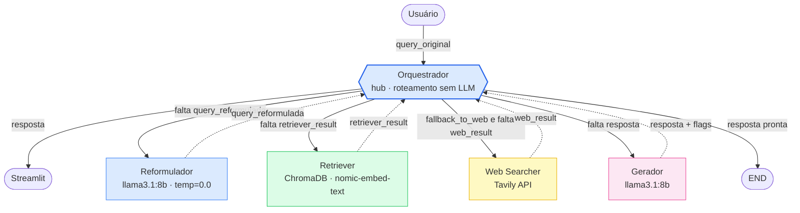

# Arquitetura — F1 RAG System

Sistema multiagente de IA para responder perguntas sobre Fórmula 1.
Combina busca vetorial em corpus próprio (RAG) com fallback para web via Tavily.

---

## Fluxo do sistema

Arquitetura **hub-and-spoke** (supervisor): o orquestrador é o agente central.
O usuário conversa apenas com o orquestrador, e cada agente especialista
conversa apenas com o orquestrador — nunca entre si. A cada rodada o
orquestrador observa o estado, decide o próximo agente de forma
determinística (sem LLM), o agente executa e devolve o resultado ao
orquestrador, que identifica o próximo passo.



Setas sólidas = orquestrador despachando para um agente; setas tracejadas =
agente devolvendo o resultado ao orquestrador. A decisão é determinística e
baseada em quais campos do `GraphState` já foram preenchidos — cada agente
preenche um campo distinto, então o fluxo sempre avança (sem ciclo infinito).

---

## Por que esse fluxo?

| Decisão | Motivo |
|---|---|
| Hub-and-spoke (orquestrador central) | Agentes desacoplados: cada um só conhece o orquestrador. Trocar/reordenar uma etapa não exige mexer nos outros agentes |
| Reformulador roda sempre | Garante que o Retriever recebe query em inglês formal, vocabulário do corpus |
| Retriever decide o `fallback` | Ele é o dono do contexto de busca — encapsula a lógica de relevância; o orquestrador só lê o flag `fallback_to_web` |
| Orquestrador sem LLM | Transições são lógica determinística sobre o estado — reduz latência, custo e facilita debugging |
| Orquestrador registra decisão no trace | Cada passo grava `decisao` + `motivo`, tornando o raciocínio do roteamento auditável |
| Caminho `low_confidence` | Usuário é avisado quando a resposta é incerta, em vez de resposta silenciosamente errada |

---

## GraphState — estado compartilhado entre os agentes

| Campo | Tipo | Escrito por | Lido por |
|---|---|---|---|
| `query_original` | `str` | Orquestrador (START) | Reformulador, Gerador |
| `session_id` | `str` | Orquestrador (START) | Todos (trace) |
| `query_reformulada` | `str` | Reformulador | Retriever, Web Searcher |
| `retriever_result` | `dict` | Retriever | Orquestrador, Gerador |
| `web_result` | `dict\|None` | Web Searcher | Gerador |
| `corpus_used` | `bool` | Gerador | Orquestrador (classifica `fonte`) |
| `web_used` | `bool` | Gerador | Orquestrador (classifica `fonte`) |
| `fonte` | `str` | Orquestrador (ao encerrar) | Streamlit, export JSON |
| `low_confidence` | `bool` | Gerador | Streamlit |
| `confidence_warning` | `str\|None` | Retriever ou Gerador | Streamlit |
| `resposta` | `str` | Gerador | Orquestrador (END), Streamlit |
| `trace` | `list[dict]` | Todos (append) | Streamlit, export JSON |

### `retriever_result` — shape completo

```python
{
    "query":              str,       # query que foi buscada
    "threshold":          float,     # valor do threshold usado
    "top_k":              int,       # número máximo de resultados pedidos
    "total_hits":         int,       # quantos chunks passaram o threshold
    "best_score":         float,     # score do chunk mais relevante (0.0 se nenhum)
    "fallback_to_web":    bool,      # True se nenhum chunk passou o threshold
    "confidence_warning": str|None,  # aviso quando baixa confiança
    "hits": [
        {
            "content":  str,   # texto do chunk
            "score":    float, # similaridade coseno (0.0 a 1.0)
            "metadata": dict,  # source_file, section, chunk_id, char_count
        }
    ]
}
```

### `web_result` — shape completo

```python
{
    "resultados": [
        {
            "titulo": str,
            "trecho": str,
            "url":    str,
        }
    ],
    "encontrou": bool,
}
```

### `trace` — cada agente appenda

Os agentes especialistas gravam entradas com `entrada`/`saida`/`latencia_ms`;
o orquestrador grava entradas próprias com `decisao`/`motivo` a cada rodada,
de modo que o trace intercala orquestrador e agentes
(`orchestrator → reformulator → orchestrator → retriever → ...`).

```python
# entrada de um agente especialista
{
    "agente":      str,        # "reformulator" | "retriever" | "web_searcher" | "generator"
    "entrada":     str | dict,
    "saida":       str | dict,
    "timestamp":   str,        # ISO 8601
    "latencia_ms": int,
}

# entrada do orquestrador
{
    "agente":    "orchestrator",
    "decisao":   str,          # próximo destino: "reformulator" | ... | "end"
    "motivo":    str,          # por que essa decisão (ex: "query ainda não reformulada")
    "timestamp": str,          # ISO 8601
}
```

---

## Contratos dos agentes

| Agente | Arquivo | Usa LLM | Lê do state | Escreve no state |
|---|---|---|---|---|
| **Reformulador** | `agents/reformulator.py` | ✅ llama3.1:8b | `query_original` | `query_reformulada`, `trace` |
| **Retriever** | `agents/retriever.py` | ❌ | `query_reformulada` | `retriever_result`, `trace` |
| **Web Searcher** | `agents/web_searcher.py` | ❌ | `query_reformulada` | `web_result`, `trace` |
| **Gerador** | `agents/generator.py` | ✅ llama3.1:8b | `query_original/query_reformulada`, `retriever_result`, `web_result` | `resposta`, `corpus_used`, `web_used`, `low_confidence`, `confidence_warning`, `trace` |
| **Orquestrador** | `orchestration/orchestrator.py` | ❌ | todo o `GraphState` (decide próximo passo por quais campos estão preenchidos) | `trace` (decisao/motivo a cada rodada), `fonte` (ao encerrar) |

---

## Stack tecnológico

| Camada | Tecnologia | Onde é usado |
|---|---|---|
| Linguagem | Python 3.11+ | Todo o projeto |
| Orquestração | LangGraph | `orchestration/orchestrator.py` |
| LLM | Ollama · `llama3.1:8b` | Reformulador, Gerador |
| Embeddings | Ollama · `nomic-embed-text` | Retriever |
| Vector store | ChromaDB | Retriever |
| Busca web | Tavily API | Web Searcher |
| Interface | Streamlit | `app.py` |
| Infraestrutura | Docker Compose | Serviço `ollama` |
| Testes | pytest | `tests/` |

---

## Variáveis de ambiente

| Variável | Default | Descrição |
|---|---|---|
| `OLLAMA_BASE_URL` | `http://localhost:11434` | Endereço do servidor Ollama |
| `LLM_MODEL` | `llama3.1:8b` | Modelo LLM para Reformulador e Gerador |
| `EMBEDDING_MODEL` | `nomic-embed-text` | Modelo de embeddings para o Retriever |
| `CHROMA_PERSIST_DIR` | `./dados/vectorstore` | Caminho do vector store persistente |
| `CHROMA_COLLECTION` | `fia_2026_regulations` | Nome da coleção no ChromaDB |
| `RETRIEVER_THRESHOLD` | `0.75` | Similaridade mínima para usar um chunk |
| `RETRIEVER_TOP_K` | `5` | Número máximo de chunks retornados |
| `TAVILY_API_KEY` | — | Chave da API Tavily (obrigatória para web search) |
| `TRACES_DIR` | `./traces` | Diretório para export de traces JSON |
