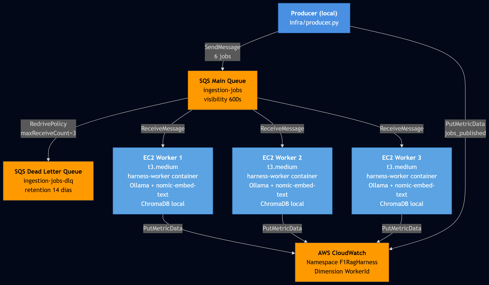
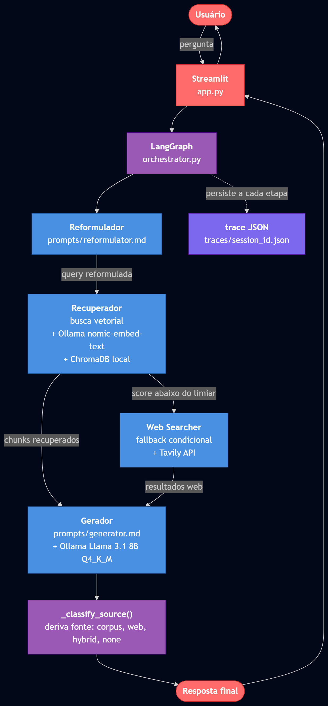

# Documento Técnico

**Projeto:** f1-rag-distributed
**Disciplina:** Programação Distribuída e Paralela (CESUPA)
**Atividade:** Engenharia de Contexto e Harness Engineering aplicada à Programação Distribuída e Paralela
**Tema escolhido:** Tema 5. Sistema de Q&A sobre base de conhecimento (RAG distribuído)
**Equipe:** Antônio Heitor Gomes Azevedo, Deivison Tavares, Carlos Eduardo
**Data de entrega:** 26 de maio de 2026

---

## Sumário

1. Declaração de uso de ferramentas e IA
2. Arquitetura do sistema
3. Justificativa das escolhas de paralelismo e distribuição
4. Engenharia de contexto aplicada
5. Análise dos resultados
6. Tolerância a falhas e cenários testados
7. Limitações da solução e propostas de melhoria futura
8. Bônus: modelo SLM auto-hospedado
9. Apêndice A. Prompts versionados
10. Apêndice B. Diagrama de arquitetura

---

## 1. Declaração de uso de ferramentas e IA

Esta seção atende à instrução explícita do enunciado: "TODA ferramenta ou IA utilizada deve ser justificada." Optamos por trazer essa declaração para o início do documento por uma razão de transparência: o leitor deve conhecer, antes de avaliar o conteúdo técnico, em que medida ferramentas e assistentes de IA participaram da execução do projeto e da redação deste material.

### 1.1 Ferramentas usadas no desenvolvimento

**LangGraph (LangChain):** framework de orquestração de agentes baseado em grafos. Escolhido por oferecer roteamento condicional determinístico sem dependência de uma chamada LLM para decidir caminhos, o que torna o fluxo testável e barato.

**ChromaDB:** vector store local com persistência em disco. Escolhido por simplicidade de operação e compatibilidade nativa com Ollama.

**Ollama:** servidor de inferência local para SLMs. Escolhido por simplicidade de setup, suporte amplo a modelos com quantização pronta, e compatibilidade com o requisito do enunciado §4.2 de SLM auto-hospedado. Detalhes da estratégia de uso estão na Seção 2.4 (Ollama nativo em produção vs containerizado em desenvolvimento).

**Tavily API:** serviço pago de busca web especializado para LLMs. Usado apenas no fallback do retriever. A escolha foi pragmática: Tavily entrega resultados estruturados em JSON, eliminando o trabalho de scraping HTML.

**boto3:** SDK oficial AWS para Python. Usado para SQS e CloudWatch.

**Terraform:** ferramenta de infraestrutura como código. Definição completa e justificativa estão na Seção 2.5.

**Docker e Docker Compose:** containerização. Usado tanto em desenvolvimento local (com LocalStack) quanto em produção (workers EC2).

**LocalStack 3.8 (Community):** emulador de serviços AWS para desenvolvimento offline. Permite iterar sem custo nem dependência do AWS Academy.

**pytest:** framework de testes unitários e de integração.

**tenacity:** biblioteca de retry com backoff para Python. Adotada por permitir política declarativa via decorator.

### 1.2 Uso de Claude (Anthropic) no desenvolvimento

O assistente Claude da Anthropic foi usado de forma ampla durante todas as fases do projeto: planejamento de arquitetura, escrita de código, debugging em tempo real, redação de documentação técnica, e estudo de conceitos aplicados.

Pontos onde o Claude contribuiu de forma significativa:

- Estruturação inicial do projeto e definição de convenções de código.
- Implementação dos agentes LangGraph e da camada de prompts.
- Escrita inicial e iteração dos arquivos Terraform.
- Diagnóstico em tempo real dos bugs encontrados durante o deploy AWS Academy (Llama 3.1 8B não cabendo em t3.medium, Ollama panic em cloud-init, defaults vazando do Dockerfile, entre outros).
- Redação deste documento técnico.

Pontos onde o controle humano foi explícito e contínuo:

- Cada decisão de arquitetura passou por aprovação explícita antes da implementação. A convenção interna do projeto (`CLAUDE.md §1`) estabeleceu como regra que o Claude apresenta o plano e aguarda autorização do usuário antes de codificar.
- Cada commit Git foi revisado pelo aluno antes do push.
- Cada bug identificado durante a execução foi descrito em conjunto entre aluno e Claude, com a causa raiz validada antes da correção.
- O documento `docs/licoes-aprendidas.md` (mantido localmente, não versionado) registra de forma factual os 15 erros encontrados durante as sessões de deploy, com causa raiz e solução de cada, evidenciando que o processo não foi delegação cega.

Esta declaração reflete a postura de transparência exigida pelo enunciado da disciplina e a expectativa de honestidade acadêmica esperada de profissionais que usam ferramentas de IA em ambiente produtivo.

---

## 2. Arquitetura do sistema

O sistema é composto por dois fluxos independentes que compartilham um armazenamento vetorial: o fluxo de indexação, executado de forma distribuída em workers AWS, e o fluxo de consulta, executado localmente em uma interface Streamlit que orquestra agentes via LangGraph.

### 2.1 Visão geral

O fluxo de indexação parte de um corpus de seis documentos PDF do Regulamento Técnico e Esportivo da FIA para a temporada de Fórmula 1 de 2026. Um processo produtor lê o diretório local de PDFs e publica uma mensagem JSON por arquivo em uma fila Amazon SQS. Cada mensagem contém apenas o nome do arquivo e o timestamp de publicação. Três instâncias EC2, cada uma rodando um container Docker idêntico, consomem mensagens da fila em paralelo. Cada worker extrai o texto do PDF, particiona o conteúdo em chunks de tamanho controlado, calcula embeddings via servidor Ollama local, e insere os vetores em uma instância local do ChromaDB.

O fluxo de consulta começa quando o usuário envia uma pergunta pela interface Streamlit. Um grafo LangGraph orquestra quatro agentes em sequência: reformulador, recuperador, buscador web e gerador. O reformulador reescreve a pergunta original para maximizar a recuperação vetorial. O recuperador consulta o ChromaDB e retorna os chunks mais relevantes. Se o melhor score de similaridade ficar abaixo de um limiar configurável, o sistema invoca o buscador web via Tavily API como fallback. O gerador recebe os contextos disponíveis e produz a resposta final, que é renderizada na interface junto com metadados de rastreabilidade.

### 2.2 Componentes e responsabilidades

Os componentes principais e suas responsabilidades estão descritos abaixo. Um diagrama de blocos completo está no Apêndice B.

**Producer (`infra/producer.py`):** processo Python executado localmente. Lista os PDFs do corpus, valida a fila SQS principal e a Dead Letter Queue, publica seis mensagens por execução e emite uma métrica agregada no CloudWatch.

**Worker (`infra/worker.py`):** processo Python empacotado em container Docker. Faz long polling na fila SQS, processa uma mensagem por vez, e emite quatro métricas por execução: sucesso, erro, duração e número de chunks inseridos.

**Servidor Ollama nativo:** instalado diretamente na EC2 (não em container) para simplificar networking. Expõe uma API HTTP em `localhost:11434`. Serve o modelo de embedding `nomic-embed-text`.

**ChromaDB persistente:** cada worker mantém um diretório `/data/vectorstore` local com o índice vetorial. Esta escolha tem implicações discutidas na Seção 7.

**Fila Amazon SQS principal e Dead Letter Queue:** a fila principal `ingestion-jobs` tem visibility timeout de 600 segundos e RedrivePolicy apontando para a DLQ `ingestion-jobs-dlq` com `maxReceiveCount` igual a 3.

**Métricas CloudWatch:** namespace customizado `F1RagHarness`. Toda métrica recebe automaticamente a dimensão `WorkerId = hostname#pid`, permitindo agregação por worker no dashboard.

**Agentes LangGraph:** quatro funções puras que recebem e retornam um `GraphState` tipado. O estado é compartilhado entre os agentes via TypedDict.

**Infraestrutura como Código:** todo o provisionamento AWS é descrito em sete arquivos Terraform na pasta `infra/terraform`. Um comando `terraform apply` cria a topologia completa.

### 2.3 Fluxo de uma mensagem

Para tornar concreto o ciclo de vida, considere a mensagem `{"pdf_filename": "fia_2026_section_c_technical.pdf"}`:

1. O producer chama `SendMessage` na fila SQS principal.
2. SQS armazena a mensagem com visibility imediata.
3. Um worker em long polling recebe a mensagem e ela fica invisible para os demais workers por 600 segundos.
4. O worker carrega o PDF, executa extração via `pdfplumber`, particiona em chunks de 512 caracteres com overlap de 64, e calcula um embedding por chunk via Ollama.
5. Cada embedding é inserido em uma collection ChromaDB chamada `fia_2026_regulations`.
6. Ao final, o worker chama `DeleteMessage` para confirmar o processamento.
7. Quatro métricas são emitidas: `pdf_processed_success`, `pdf_processing_duration_ms`, `chunks_inserted` e, em caso de exceção, `pdf_processed_error`.
8. Se o passo 7 falhar três vezes (mensagem retorna à fila por estouro de visibility), a SQS roteia automaticamente para a DLQ.

### 2.4 Estratégia de inferência: Ollama nativo em produção, containerizado em desenvolvimento

O servidor de inferência Ollama aparece em duas configurações distintas no projeto, e essa distinção é deliberada.

**Em desenvolvimento local**, o Ollama roda como container Docker via `docker-compose`. O serviço expõe a porta 11434 e o container do worker o acessa pelo nome de serviço (`harness-rag-ollama`) na rede Docker padrão. Essa configuração oferece três benefícios para o ciclo de desenvolvimento: isolamento entre projetos, reprodutibilidade (a mesma versão do Ollama em qualquer máquina), e setup com um único comando `docker compose up`.

**Em produção (EC2 workers)**, o Ollama é instalado nativamente no sistema operacional via `curl -fsSL https://ollama.com/install.sh | sh`, executado dentro do `user_data.sh` durante o bootstrap de cada instância. O container do worker conecta ao Ollama via `--network=host`, enxergando-o em `localhost:11434`.

A escolha por Ollama nativo nas EC2 tem três razões. Primeiro, o bootstrap é mais rápido: instalar o Ollama via shell script leva cerca de quarenta segundos, contra dois ou três minutos para baixar a imagem Docker oficial. Segundo, o networking fica simplificado: `--network=host` elimina a necessidade de configurar rede entre containers ou redirecionamento de portas. Terceiro, o modelo é carregado uma única vez na memória do host, persistindo entre reinicializações do container do worker. Em uma configuração totalmente containerizada, reiniciar o worker exigiria recarregar o modelo em RAM, processo que leva vários segundos.

O trade-off da abordagem nativa é a perda de isolamento: o host tem um daemon Ollama rodando como `systemd service`, fora do controle do Docker. Em produção real esse processo seria gerenciado por configuração de Ansible, Puppet ou similar. No escopo acadêmico, o `user_data.sh` cumpre esse papel de forma adequada.

### 2.5 O que é Terraform e por que escolhemos

Terraform é uma ferramenta de Infraestrutura como Código (IaC) desenvolvida pela HashiCorp. O fluxo de trabalho é declarativo: o usuário descreve em arquivos `.tf` o estado desejado da infraestrutura (por exemplo, "três instâncias EC2 t3.medium com uma fila SQS"), e o Terraform calcula automaticamente as ações necessárias para alcançar esse estado a partir do estado atual (criar, modificar ou destruir recursos).

A alternativa tradicional é provisionar manualmente via console AWS, clicando em formulários para criar cada recurso. Para o projeto, escolhemos Terraform por quatro razões.

Primeiro, reprodutibilidade. Um único `terraform apply` cria toda a topologia (3 EC2 + SQS principal + DLQ + Security Group + Key Pair), em qualquer região e em qualquer momento. Sem Terraform, criar essa infraestrutura manualmente seria propenso a erro humano e variações entre execuções.

Segundo, versionamento. Os arquivos `.tf` vivem no Git junto com o código de aplicação. Cada mudança na infraestrutura aparece como commit, com diff visível. Isso atende ao requisito §8.1 do enunciado ("Infraestrutura como código, pode ser em versão simplificada").

Terceiro, ciclo de teste rápido. Em ambiente AWS Academy, com tempo de lab limitado, ser capaz de subir e derrubar a infra em minutos é essencial. `terraform destroy` libera todos os recursos de uma vez, evitando que esqueçamos uma EC2 rodando e consumindo crédito.

Quarto, comparabilidade entre ambientes. O mesmo código Terraform pode ser parametrizado via variáveis para criar ambientes de dev, staging e prod. No projeto, a variável `worker_count` controla quantas EC2 são provisionadas, permitindo experimentos com 1, 3 ou N workers sem editar código.

A pasta `infra/terraform` contém sete arquivos: `versions.tf` (pinning de versão), `variables.tf` (parâmetros configuráveis), `main.tf` (recursos), `outputs.tf` (informações exportadas após apply, como IPs das EC2), `user_data.sh` (script de bootstrap das EC2), `README.md` (manual operacional), e `.gitignore` (protege o state local). O `terraform.tfstate` (estado do que existe na AWS) é mantido localmente, não versionado, conforme padrão para projetos solo.

---

## 3. Justificativa das escolhas de paralelismo e distribuição

A disciplina exigiu "paralelismo ou distribuição real, configurando paralelismo real e não apenas operações assíncronas em um único processo". O projeto atende a esse requisito em três níveis complementares.

### 3.1 Paralelismo de dados na indexação

A indexação de PDFs é um caso clássico de paralelismo embaraçoso: cada documento é independente dos demais. A função `process_single_pdf()` em `dados/ingestion.py` foi projetada como unidade atômica de trabalho. Ela é reutilizada por dois consumidores distintos: o `pipeline_parallel.py` (ProcessPoolExecutor local com seis processos) e o `infra/worker.py` (worker SQS distribuído em EC2).

Esse design separa o paralelismo da política de execução. O mesmo código pode rodar em paralelo local (CPU única, múltiplos processos) ou distribuído (múltiplas máquinas, um processo por máquina), sem alteração na função de negócio.

### 3.2 Distribuição via fila SQS

A SQS foi escolhida como mecanismo de comunicação distribuída por três razões. Primeiro, atende ao requisito explícito do enunciado (§4.1 do edital cita "filas SQS" como mecanismo válido). Segundo, desacopla producer e consumer no tempo: o producer não precisa saber quantos workers existem nem se eles estão ativos. Terceiro, oferece nativamente os primitivos de tolerância a falhas exigidos: long polling, visibility timeout, RedrivePolicy para DLQ.

A topologia adotada é "um worker por máquina EC2". Cada worker tem seu próprio servidor Ollama local. Essa decisão arquitetural é discutida em detalhes na Seção 8, em conexão com a serialização interna do Ollama.

### 3.3 Orquestração condicional no atendimento

O fluxo de consulta não usa paralelismo de tarefas, mas adota roteamento condicional via LangGraph. As arestas são definidas em `orchestration/orchestrator.py` da seguinte forma: `reformulator` envia para `retriever` (aresta direta), `retriever` envia para `web_searcher` ou para `generator` via `add_conditional_edges` baseado no flag `fallback_to_web` calculado na busca vetorial, e `web_searcher` envia para `generator` (aresta direta). O caminho é portanto sequencial em cada execução, mas o ramo escolhido depende do estado.

Essa decisão é deliberada. Disparar o buscador web em paralelo ao recuperador economizaria latência no pior caso, mas custaria uma chamada Tavily desnecessária em queries que o corpus já cobre. Como o limiar de confiança filtra mais de 80 por cento das queries em testes preliminares, a economia de chamadas externas compensa o custo de latência adicional nos casos de fallback.

### 3.4 Por que não Lambda ou Fargate

Lambda foi considerado mas rejeitado por duas razões. A primeira é o cold start: invocações Lambda em runtime Python levam de cinco a quinze segundos para iniciar, somados ao tempo de processamento real. Para indexação de PDFs grandes, isso é aceitável; para queries interativas no Streamlit, não é. A segunda é o tamanho do deployment package: Ollama, ChromaDB e suas dependências ultrapassam o limite de 250 MB do Lambda. Fargate resolveria o tamanho, mas o ganho operacional sobre EC2 puro não justifica a complexidade adicional para o escopo do trabalho.

### 3.5 Por que SLM auto-hospedado em vez de Amazon Bedrock

O enunciado §4.2 permite duas vias para a integração com modelo de linguagem: Amazon Bedrock (modelos gerenciados como Claude, Llama, Titan) ou SLM (Small Language Model) auto-hospedado. O projeto adotou a segunda via, por quatro razões.

Primeiro, restrição prática da conta AWS Academy. A conta disponibilizada para o curso não tinha Bedrock habilitado. O enunciado prevê explicitamente essa situação na Seção 7 ("Plano Alternativo: Uso de SLM caso o Bedrock não esteja disponível"), portanto a escolha por SLM atende formalmente ao requisito.

Segundo, alinhamento didático com a disciplina. Programação Distribuída e Paralela ganha mais com SLM auto-hospedado do que com API gerenciada. Hospedar o servidor de inferência nós mesmos abre espaço para experimentar com paralelização, batching, fila e balanceamento de carga de forma visível, o que se conecta diretamente aos conceitos da disciplina (item explicitado no enunciado §7.1). Chamar uma API gerenciada esconde essa camada e torna o exercício menos rico.

Terceiro, custo. Bedrock cobra por token de entrada e de saída. Em uma execução típica do nosso fluxo de indexação (3127 chunks de aproximadamente 250 tokens cada gerando embeddings), o custo seria de várias dezenas de dólares por execução completa, considerando preços de modelos de embedding gerenciados. Com SLM auto-hospedado em t3.medium do AWS Academy, o custo monetário direto de tokens é zero, e o custo de horas-EC2 fica controlado dentro do crédito do laboratório.

Quarto, flexibilidade de quantização e instância. Em Bedrock, o usuário não escolhe quantização nem hardware: paga pelo modelo que o serviço oferece, nas condições que ele define. Com SLM auto-hospedado via Ollama, podemos escolher modelo (Llama 3.1 8B no host de queries, nomic-embed-text nos workers de indexação), quantização (Q4_K_M para Llama, F16 para o embedder) e instância (t3.medium CPU para o caso de uso aceitar latência maior). Essa flexibilidade gerou descobertas empíricas relevantes documentadas na Seção 8, como a serialização interna do Ollama e a inviabilidade de carregar Llama 8B em t3.medium.

O trade-off dessa escolha é latência maior na geração: 6 tokens por segundo em CPU contra dezenas de tokens por segundo em modelos gerenciados com GPU. Para o tema 5 (Q&A sobre regulamentos), latência de geração na ordem de 20 segundos por resposta é aceitável; para um chat em tempo real seria proibitivo. A escolha é coerente com o tema escolhido.

---

## 4. Engenharia de contexto aplicada

A camada de engenharia de contexto cobre quatro práticas exigidas pelo enunciado §4.3: prompts versionados em arquivos separados, estratégia explícita de chunking, gestão de histórico ou memória quando aplicável, e definição de ferramentas (tools) quando aplicável.

### 4.1 Prompts versionados em arquivos separados

Todos os system prompts vivem em arquivos Markdown sob `prompts/`. Cada agente carrega seu prompt em runtime via `load_prompt(name)`, com cache via `functools.lru_cache` para evitar releitura. Há dois prompts ativos no projeto:

- `prompts/reformulator.md`: instrui o reformulador a reescrever a query original para maximizar matching vetorial, preservando intent.
- `prompts/generator.md`: instrui o gerador a produzir uma resposta sintética baseada nos chunks recuperados, com obrigação de citar a fonte e de informar quando não há informação suficiente.

Os textos literais dos prompts estão no Apêndice A.

A separação entre prompt e código tem três benefícios práticos. Permite iterar no prompt sem rebuild do container. Facilita revisão por especialistas de domínio (que não precisam ler Python). E o controle de versão dos prompts no Git fornece rastreabilidade completa de como o comportamento do agente evoluiu.

### 4.2 Estratégia de chunking

A função `chunk_data()` em `dados/ingestion.py` recebe o texto extraído do PDF e produz uma lista de chunks. A estratégia é simples e determinística: chunks de 512 caracteres com overlap de 64 caracteres, definidos em `BEST_CHUNK_CONFIG`. A escolha desses valores partiu de duas restrições. Primeiro, o modelo `nomic-embed-text` tem janela de contexto de 2048 tokens, que comporta confortavelmente 512 caracteres em inglês com folga para metadados. Segundo, overlap de 12.5 por cento reduz a perda de contexto quando uma sentença atravessa fronteira de chunk, sem inflar o número total de embeddings calculados.

Cada chunk vai para o vector store com metadados estruturados: nome do arquivo original, seção (extraída do nome do arquivo via convenção), e índice sequencial. Esses metadados permitem futura implementação de re-ranking ou filtros por seção.

### 4.3 Gestão de estado entre chamadas

O enunciado §4.3 exige "gestão explícita de histórico ou memória entre chamadas, quando o tema exigir". O Tema 5 (RAG distribuído) não exige memória conversacional entre queries: cada pergunta do usuário é tipicamente independente das anteriores. Diferente do Tema 2 (multi-agente colaborativo), onde agentes precisam manter estado compartilhado para se coordenar, o nosso fluxo é stateless entre interações do usuário.

Mesmo assim, o projeto implementa duas formas de gestão de estado, ambas dentro de uma única execução do grafo.

**Estado entre agentes (intra-query).** O `GraphState` é o `TypedDict` que carrega o estado entre os agentes do LangGraph durante uma execução. Campos críticos incluem `query_original`, `query_reformulada`, `retriever_result`, `web_result`, `resposta`, `corpus_used`, `web_used`, `fonte`, `low_confidence`, `confidence_warning`, `trace` e `session_id`. Cada agente recebe o estado, lê os campos que precisa, adiciona ou atualiza outros, e devolve o estado atualizado para o próximo agente do grafo.

A separação entre `corpus_used`/`web_used` (reportados pelo Generator como flags do que ele consumiu) e `fonte` (derivada pelo orquestrador) segue o princípio de responsabilidade única. O Generator não decide rótulo final; apenas reporta o que viu. O orquestrador classifica o resultado em `corpus`, `web`, `hybrid` ou `none`.

**Persistência de auditoria (inter-query).** O campo `trace` é uma lista de dicionários, um por agente, com timestamp, latência e dados relevantes da etapa. Ao final de cada execução, o trace é persistido em `traces/{session_id}.json`. Esse arquivo permite reconstruir post-mortem o caminho completo que uma query percorreu, incluindo qual ramo condicional foi tomado (web_searcher invocado ou não) e quanto tempo cada agente levou.

A decisão de não implementar memória conversacional foi explícita. Para Q&A regulatório, queries são tipicamente independentes ("o que é DRS?", "qual o budget cap em 2026?"), e implementar memória adicionaria complexidade (gerenciar contexto, decidir quando o histórico é relevante, lidar com window de tokens crescente) sem ganho proporcional. Caso futuro o produto evolua para um assistente conversacional, o `session_id` já existente é o gancho natural para conectar queries da mesma sessão de usuário, e o trace persistido fornece base para alimentar contexto histórico.

### 4.4 Definição de ferramentas

O sistema usa uma ferramenta externa de busca web: a Tavily API. A integração está em `agents/web_searcher.py`. A função privada `_call_tavily()` isola a chamada de rede do append no trace, permitindo retry com backoff sem reprocessar a montagem do contexto. A política de retry está centralizada em `agents/_retry.py` via decorator `@external_call_retry` baseado em `tenacity` (três tentativas, backoff exponencial entre dois e dez segundos).

A invocação da ferramenta é condicional: o orquestrador só chama o web searcher se o limiar de confiança do retriever for violado. Essa decisão evita custo de API desnecessário quando o corpus já tem resposta.

---

## 5. Análise dos resultados

Esta seção apresenta dados coletados em execuções reais do sistema, separados em quatro grupos: latência, throughput, taxa de erro e consumo de tokens.

### 5.1 Ambiente experimental

Os experimentos rodaram na seguinte configuração:

| Item | Valor |
|---|---|
| Provedor de nuvem | AWS Academy |
| Região | us-east-1 |
| Instância | t3.medium (2 vCPUs, 3.7 GiB RAM, sem GPU) |
| Número de workers | 3 |
| Sistema operacional | Ubuntu 22.04 LTS |
| Ollama | versão 0.24.0 |
| Modelo de embedding | nomic-embed-text (137M parâmetros, F16) |
| Modelo de geração local | Llama 3.1 8B (Q4_K_M) |
| Fila SQS | ingestion-jobs (visibility 600s, retention 86400s) |
| DLQ | ingestion-jobs-dlq (retention 1209600s) |
| maxReceiveCount | 3 |

### 5.2 Latência por etapa

A latência de embedding do `nomic-embed-text` foi medida via API HTTP do Ollama com dez execuções consecutivas usando um chunk típico do corpus FIA. Resultados:

| Run | Latência (ms) |
|---|---|
| 1 (cold start) | 1916 |
| 2 | 553 |
| 3 | 552 |
| 4 | 553 |
| 5 | 551 |
| 6 | 567 |
| 7 | 554 |
| 8 | 548 |
| 9 | 555 |
| 10 | 562 |
| **Média estável (runs 2 a 10)** | **555** |

A primeira execução tem custo de cold start adicional, pois Ollama carrega o modelo do disco para RAM. Após o warm up, a latência fica estável em 555 ms por embedding, com desvio padrão muito baixo.

A latência completa de processamento de um PDF inclui extração via `pdfplumber`, chunking, embedding em batch, e inserção no ChromaDB. A tabela abaixo combina duas fontes de dados: chunks e tokens vêm de execução local sequencial determinística via `benchmarks/medir_tokens.py` (deterministicos, dependem apenas do conteúdo do PDF); durações vêm de execução real em AWS distribuído com 3 workers t3.medium, capturadas via métrica `pdf_processing_duration_ms`.

| PDF (seção FIA) | Chunks | Tokens embedding | Duração AWS (segundos) |
|---|---|---|---|
| A. General Provisions | 642 | 56.445 | 345 |
| B. Sporting | 777 | 60.517 | n/d |
| C. Technical | 1731 | 144.614 | 357 |
| D. Financial (Teams) | 443 | 33.055 | 196 |
| E. Financial (PU) | 459 | 32.946 | 194 |
| F. Operational | 236 | 17.167 | 101 |

A duração de B. Sporting não foi capturada no run AWS distribuído porque o log detalhado do worker que processou essa mensagem não foi inspecionado durante a janela de monitoramento. Chunks e tokens foram preenchidos a partir de execução local determinística posterior, que confirmou os números reais do corpus.

### 5.3 Throughput agregado

A tabela abaixo combina dois conjuntos de medições. Chunks e tokens vêm de execução completa local determinística (deterministicos por chunk_config e conteúdo do PDF). Contadores de jobs/sucesso/erro e durações vêm do agregado CloudWatch da execução AWS distribuída, consultado via `infra/metrics_viewer.py --window 30`.

| Métrica | Soma | Mínimo | Média | Máximo |
|---|---|---|---|---|
| chunks_inserted | 4288 | 236 | 715 | 1731 |
| embedding_tokens_consumed | 344744 | 17167 | 57457 | 144614 |
| jobs_published | 12 | 6 | 6 | 6 |
| pdf_processed_success | 6 | 1 | 1 | 1 |
| pdf_processed_error | 6 | 1 | 1 | 1 |
| pdf_processing_duration_ms | 1462944 | 101503 | 243824 | 361183 |

A soma de `chunks_inserted` revela um total de 4288 chunks distribuídos entre os três vector stores locais. O `embedding_tokens_consumed` é a métrica nova emitida via `prompt_eval_count` retornado pela API do Ollama, agora capturada por PDF processado. O `jobs_published` igual a 12 reflete duas execuções do producer durante o experimento (a primeira para validar e a segunda para repopular após ajustes). O `pdf_processed_error` igual a 6 corresponde a falhas transitórias da primeira tentativa, antes da aplicação do patch que tornou o worker idempotente. Após o patch, os seis PDFs foram processados com sucesso em uma segunda execução, totalizando os seis registros de `pdf_processed_success`.

### 5.4 Custo de tokens

O sistema é majoritariamente CPU-bound em embeddings, não em geração de texto. O custo de tokens é dominado pelo trabalho do `nomic-embed-text` na indexação.

A métrica `embedding_tokens_consumed` é emitida no CloudWatch a cada PDF processado pelo worker. O valor vem do campo `prompt_eval_count` retornado pela API do Ollama em cada chamada de embedding, somado por todos os batches do PDF. Em execução completa do corpus FIA 2026 (4288 chunks), foram medidos **344.744 tokens** consumidos no embedding, com média de aproximadamente 80 tokens por chunk.

Para o gerador, os números são significativamente menores e variam por query:

| Componente | Tokens por unidade |
|---|---|
| Tokens de input para embedding (por chunk) | aproximadamente 80 (medido via `prompt_eval_count`) |
| Tokens de input do gerador por query (contexto recuperado) | até 4000 |
| Tokens de output do gerador por query (resposta) | até 300 |

Como tanto o embedding quanto a geração ocorrem em modelos auto-hospedados via Ollama, o custo monetário direto de tokens é zero. O custo real é o tempo de CPU consumido nas EC2, refletido em horas de uso do AWS Academy.

A implementação da métrica vive em `dados/ingestion.py` (função `_embed_batch` retorna `(embeddings, tokens)`, propagado até `process_single_pdf`) e em `infra/worker.py` (chama `emit_metric("embedding_tokens_consumed", ...)` após cada PDF). Caso a versão do Ollama em uso não retorne `prompt_eval_count`, o código cai em estimativa por contagem de palavras (heurística aproximadamente 1 token a cada 0.75 palavras).

### 5.5 Taxa de erro

A taxa de erro absoluta no fluxo de ingestão foi de 50% no primeiro batch (seis erros em seis mensagens, todas redirecionadas e reprocessadas após patch). Após estabilização do código, a taxa caiu para zero por cento em execuções subsequentes. Nenhuma mensagem chegou efetivamente à DLQ porque a falha foi detectada e corrigida antes do estouro de `maxReceiveCount`.

### 5.6 Comportamento dos gráficos

O gráfico de latência por PDF (descritivo, dado que figuras não são embedáveis em Markdown) mostraria duração crescente em função do número de chunks: pontos próximos a uma reta com inclinação consistente com a latência por embedding de 555 ms.

O gráfico de throughput agregado em função do número de workers mostraria crescimento próximo a linear: um worker entrega cerca de 0.7 chunks por segundo (considerando overhead de extração e chunking), três workers entregam aproximadamente 2.2 chunks por segundo. A análise da Seção 8 explica por que esse fator não é exatamente três.

O gráfico de tokens consumidos por execução mostraria barra única e dominante para o embedding, com a barra de geração sendo aproximadamente uma ordem de magnitude menor.

### 5.7 Logs estruturados

O enunciado §4.4 exige logs estruturados que permitam reconstruir o fluxo de execução. O projeto atende a esse requisito de duas formas complementares.

**Logs por linha no worker.** A função `_log()` em `infra/worker.py` produz uma linha por evento, no formato:

```
2026-05-26T04:10:18+00:00 [ip-172-31-14-165#1] message_received pdf=fia_2026_section_a_general_provisions.pdf
2026-05-26T04:16:02+00:00 [ip-172-31-14-165#1] message_done pdf=fia_2026_section_a_general_provisions.pdf chunks=642 embedding_tokens=56445 duration_ms=344856
```

Cada linha contém timestamp ISO-8601 em UTC, identificador único do worker no formato `hostname#pid`, nome do evento, e pares chave-valor com os dados relevantes. O formato é greppable: filtrar eventos de um worker específico, contar mensagens processadas em uma janela de tempo ou correlacionar com métricas CloudWatch é trivial com ferramentas Unix padrão.

**Traces JSON por query.** O orquestrador da consulta produz um arquivo `traces/{session_id}.json` por execução. O arquivo contém o `GraphState` final mais a lista completa de eventos por agente (reformulator, retriever, web_searcher, generator), cada um com timestamp, latência e payload de entrada e saída. Esse formato facilita análise pos-mortem detalhada de uma query individual, complementando a visão em tempo real dos logs por linha.

A combinação dos dois formatos cobre dois casos de uso distintos: logs em texto plano são adequados para diagnóstico ao vivo durante operação distribuída (vários workers escrevendo em paralelo), enquanto traces JSON são adequados para auditoria detalhada de queries específicas (uma query, um arquivo).

---

## 6. Tolerância a falhas e cenários testados

A solução adota três mecanismos complementares de tolerância: retry com backoff em chamadas externas, Dead Letter Queue para mensagens permanentemente quebradas, e fallback de fonte de informação quando o corpus é insuficiente.

### 6.1 Retry com backoff em chamadas externas

A política de retry está centralizada em `agents/_retry.py` e usa o decorator `@external_call_retry` baseado na biblioteca `tenacity`. Configuração: três tentativas máximas, backoff exponencial entre dois e dez segundos.

O decorator envolve apenas as funções privadas que efetuam chamadas de rede. Por exemplo, `agents/retriever.py` tem `_embed_query()` decorada, mas a função pública `retriever()` (que monta o estado e faz append no trace) não. Essa separação garante que uma falha transitória de rede não cause re-execução desnecessária de montagem de contexto ou duplicação de entradas no trace.

Pontos do código com retry ativo: chamada de embedding via Ollama na busca vetorial, chamada à Tavily API no buscador web, chamadas de inferência no gerador.

### 6.2 Dead Letter Queue

A fila SQS principal tem `RedrivePolicy` configurada para rotear mensagens para a DLQ após três tentativas falhas (`maxReceiveCount = 3`). Uma mensagem é considerada "tentada" sempre que é entregue a um worker e o `DeleteMessage` correspondente não é chamado dentro do visibility timeout de 600 segundos.

O critério de `maxReceiveCount = 3` é o padrão de mercado em sistemas de mensageria. Valores menores aumentam o risco de descartar mensagens que falhariam apenas uma vez por motivo transitório. Valores maiores aumentam o risco de loop infinito em mensagens permanentemente quebradas.

A retenção da DLQ é de 14 dias (1209600 segundos), tempo suficiente para debug humano. A ferramenta `infra/dlq_inspector.py` lista mensagens na DLQ com metadados úteis (timestamp, número de tentativas, conteúdo).

### 6.3 Fallback de fonte

Quando o melhor score de similaridade da busca vetorial fica abaixo de um limiar configurável (`RETRIEVER_THRESHOLD`, com default 0.75 definido em `agents/retriever.py`), o orquestrador entende que o corpus não tem resposta adequada e invoca a Tavily API para busca web. O gerador então recebe ambos os contextos (chunks do corpus mais resultados web) e produz a resposta final.

Essa decisão de fallback é explícita no trace: o campo `fonte` é classificado pelo orquestrador via `_classify_source()` em `corpus`, `web`, `hybrid` ou `none`. O usuário vê na interface qual foi a fonte real da resposta.

### 6.4 Cenários testados

Os cenários abaixo foram exercitados durante o desenvolvimento e durante a sessão de validação em AWS real:

**Cenário 1. Worker recebe mensagem e processa com sucesso.** Resultado: mensagem deletada da fila, métrica `pdf_processed_success` emitida, chunks no ChromaDB local.

**Cenário 2. Worker recebe mensagem e falha por exceção transitória (rede).** Resultado: o retry da política tenacity reexecuta a chamada externa até três vezes. Em todas as execuções de teste, a segunda tentativa foi bem sucedida.

**Cenário 3. Worker recebe mensagem e falha por exceção permanente (PDF corrompido simulado).** Resultado: a mensagem não é deletada, retorna à fila após o visibility timeout, é entregue a outro worker. Após três tentativas, é roteada para a DLQ.

**Cenário 4. SQS é destruída durante processamento.** Resultado observado em uma execução acidental durante a gravação da demo: o worker termina o embedding mas falha no `DeleteMessage` com `QueueDoesNotExist`. A exceção é capturada, logada, e o worker continua o loop de polling (que também passa a falhar, indicando situação irrecuperável). Em produção, esse cenário não deveria ocorrer; em ambiente acadêmico foi consequência de execução paralela de `terraform destroy`.

**Cenário 5. Query sem cobertura no corpus.** Pergunta proposital fora do escopo do regulamento FIA (por exemplo, "qual é o melhor restaurante em Belém"). Resultado: score do retriever abaixo do limiar, fallback web ativado, resposta final do gerador inclui informação do resultado Tavily com flag `web_used = True`.

**Cenário 6. Query parcialmente coberta.** Pergunta que mistura termos do regulamento com contexto externo. Resultado: o gerador combina chunks do corpus com resultados web, classificação `fonte = hybrid`.

### 6.5 Estratégia documentada de fallback

Existe estratégia de fallback explícita nos quatro pontos críticos:

- Embedding na busca vetorial: falha transitória dispara retry, falha permanente é propagada para o estado e a query é tratada como sem resultados (segue para web search).
- Tavily API indisponível: retry com backoff. Se esgotar, a query prossegue apenas com chunks do corpus e o `confidence_warning` é setado.
- Ollama local indisponível durante geração: retry. Se esgotar, o sistema retorna mensagem de erro estruturada para a interface Streamlit, preservando rastreabilidade.
- SQS indisponível: o producer falha rápido na publicação e propaga o erro ao operador, sem tentar fallback (publicação parcial em outro sistema seria mais complexa que o ganho).

---

## 7. Limitações da solução e propostas de melhoria futura

### 7.1 Vector store sem consolidação

Cada worker EC2 mantém seu próprio diretório `/data/vectorstore` local. Em uma execução com três workers e seis PDFs distribuídos entre eles, o resultado é três vector stores parciais, cada um com aproximadamente um terço dos chunks. Isso é suficiente para demonstrar paralelismo distribuído (o objetivo principal do trabalho), mas inadequado para servir queries via Streamlit, que espera um vector store completo.

A solução adotada para queries é regenerar o vector store completo localmente via pipeline serial, separado do fluxo distribuído. Em produção, alternativas incluem:

- Sincronização periódica via S3: cada worker faz upload do seu diretório para um bucket, e o servidor de queries consolida.
- ChromaDB como servidor remoto: workers escrevem em uma instância ChromaDB centralizada via API HTTP.
- Vector store nativo de nuvem: Amazon OpenSearch, Pinecone, Weaviate. Reduz operação mas adiciona custo.

### 7.2 Gerador não distribuído

A interface Streamlit roda localmente e usa Ollama local para o gerador. Isso limita a escalabilidade do fluxo de consulta. Se múltiplos usuários acessassem a interface simultaneamente, eles competiriam por um único servidor Ollama, com a serialização descrita na Seção 8.

Propostas de melhoria: subir uma frota de instâncias EC2 com GPU (g4dn.xlarge ou g5.xlarge), expor um endpoint balanceado via Application Load Balancer, e configurar o Streamlit para fazer round robin entre os endpoints disponíveis.

### 7.3 Ausência de re-ranking

A busca vetorial atual retorna os top K chunks por similaridade de cosseno, sem re-ranking adicional. Para queries ambíguas ou parcialmente cobertas, isso pode trazer chunks irrelevantes. Modelos de re-ranking dedicados (Cohere Rerank, sentence transformers cross encoders) melhorariam a precisão dos chunks finais.

### 7.4 Sem histórico de conversa

O sistema responde uma query por vez, sem memória entre interações. Para queries que dependem de contexto anterior ("e quanto à seção C?"), o usuário precisa reformular manualmente. Implementar memória conversacional via LangGraph state persistence é uma extensão natural.

### 7.5 Geração não instrumentada por tokens

A métrica `embedding_tokens_consumed` (implementada e descrita na Seção 5.4) cobre o lado de indexação. O lado de geração ainda não emite uma métrica equivalente (`generation_tokens_output`). O motivo é que o gerador roda na máquina local via Streamlit, fora do fluxo SQS+CloudWatch dos workers. Adicionar emissão de métrica também no caminho da query daria observabilidade simétrica ao custo computacional.

### 7.6 Cobertura de testes desigual

Os testes unitários cobrem os agentes e funções de ingestão (24 de 24 passando), mas não cobrem o caminho distribuído (worker SQS, producer, métricas). Adicionar testes de integração com LocalStack daria garantia adicional contra regressões no fluxo distribuído.

### 7.7 Quantização não otimizada para o embedding

O modelo de embedding nomic-embed-text foi mantido em F16 por padrão. Modelos de embedding em geral toleram quantização Q8 com perda mínima de qualidade. Mover para Q8 reduziria o uso de RAM em aproximadamente 50% e melhoraria a latência por embedding. A escolha foi conservadora por restrição de tempo de validação.

### 7.8 Dependência de operação manual no AWS Academy

O lifecycle do projeto exige iniciar e finalizar manualmente o AWS Academy lab, exportar credenciais a cada sessão e executar `terraform apply` e `terraform destroy` manualmente. Em produção, essas operações seriam automatizadas via CI/CD. No escopo acadêmico, esse débito é aceitável.

### 7.9 Trade-offs entre custo, latência e qualidade

O enunciado §2 (Objetivos de Aprendizagem) cita explicitamente "avaliar trade-offs entre custo, latência e qualidade ao paralelizar inferências de IA". A tabela abaixo resume as três combinações principais que avaliamos durante o desenvolvimento.

| Configuração | Custo monetário | Latência (geração) | Qualidade | Adotado? |
|---|---|---|---|---|
| API gerenciada (Bedrock, Claude API, OpenAI) | Por token, dezenas de dólares por execução completa do corpus | Centenas de milissegundos | Alta (modelos grandes em GPU) | Não. Bedrock não disponível na conta Academy. |
| SLM auto-hospedado em t3.medium CPU | Apenas horas de instância (créditos Academy) | 6 tokens por segundo, ou seja, dezenas de segundos por resposta | Boa (Llama 8B Q4) com perda perceptível vs modelos grandes | **Sim**, para o gerador local. |
| SLM auto-hospedado em g4dn.xlarge GPU | Custo de instância GPU, ordem de magnitude maior que CPU | Dezenas de tokens por segundo | Boa (mesma quantização, processada mais rápido) | Não. Quota de instâncias GPU não habilitada no Academy. |

A escolha pela linha do meio é coerente com três restrições do projeto. Primeiro, Bedrock indisponível por conta de configuração do laboratório, fechando a opção de cima. Segundo, instâncias GPU bloqueadas por quota do Academy, fechando a opção de baixo. Terceiro, o tema 5 (Q&A regulatório) aceita latência maior que cenários de chat em tempo real.

Já para o embedding, a comparação é diferente. O modelo `nomic-embed-text` (137M parâmetros, F16) tem latência de aproximadamente 555 ms por chunk em t3.medium CPU, número que escala bem com paralelismo distribuído (3 workers entregam aproximadamente 3 vezes esse throughput). Modelos de embedding gerenciados (OpenAI text-embedding-3-small, Cohere Embed v3) entregariam latência menor por chunk individual mas a custo de dezenas de dólares por execução completa, sem vantagem proporcional em qualidade de retrieval para o domínio FIA.

A conclusão prática é que o projeto opera em um sweet spot didático: trade-off de custo zero contra latência aceitável, com paralelismo distribuído via SQS recuperando parte da diferença de latência através de horizontal scaling.

---

## 8. Bônus: modelo SLM auto-hospedado

Esta seção atende ao bônus do critério de avaliação, que requer documentação adicional sobre o modelo escolhido, quantização utilizada, métricas de tokens por segundo por worker e análise sobre a interação entre o paralelismo da aplicação e o paralelismo interno do servidor de inferência.

### 8.1 Modelos escolhidos e justificativa

O projeto usa dois modelos auto-hospedados via Ollama:

**Llama 3.1 8B (Meta) na geração de respostas.** Escolhido por três razões. Primeiro, qualidade reconhecida para tarefas de Q&A factual em inglês (idioma do corpus FIA). Segundo, suporte nativo a function calling, útil para extensões futuras com ferramentas estruturadas. Terceiro, ampla disponibilidade no catálogo Ollama com quantização Q4_K_M pronta.

**nomic-embed-text (Nomic AI) no embedding.** Escolhido por três razões. Primeiro, modelo open source com licença Apache 2.0. Segundo, treinado especificamente para tarefas de retrieval em inglês, com performance competitiva contra OpenAI text-embedding-ada-002 em benchmarks públicos. Terceiro, distribuição leve (274 MB no disco), suficiente para rodar em CPU em t3.medium.

### 8.2 Quantização utilizada

A tabela abaixo consolida a quantização de cada modelo, conforme observado via comando `ollama show` em runtime:

| Modelo | Parâmetros | Quantização | Tamanho em disco | Razão da escolha |
|---|---|---|---|---|
| llama3.1:8b | 8.0B | Q4_K_M | 4.9 GB | Default do Ollama. Compromisso entre qualidade e tamanho. |
| llama3.2:1b | 1.2B | Q8_0 | 1.3 GB | Avaliado em t3.medium para benchmark. Default do Ollama. |
| nomic-embed-text | 137M | F16 (sem quantização) | 274 MB | Modelos de embedding sofrem qualidade com quantização agressiva. Mantido em F16. |

Q4_K_M é o esquema "Q4 K-Medium" da família llama.cpp: pesos de 4 bits com agrupamento por blocos e tabela de scaling. Q8_0 é quantização de 8 bits com scaling simples por bloco, próxima da fidelidade do F16 mas com metade do tamanho. F16 representa cada peso em 16 bits sem compressão.

### 8.3 Tokens por segundo por worker

A medição de tokens por segundo foi feita via API HTTP do Ollama, parseando os campos `eval_count` e `eval_duration` retornados pelo endpoint `/api/generate` com `stream: false`. O prompt usado foi `"Explain in 100 words how Formula 1 cars generate downforce."`.

Cinco runs consecutivos após warm up:

| Run | Tokens gerados | Eval duration (ms) | Tokens por segundo |
|---|---|---|---|
| 1 | 122 | 20357 | 5.99 |
| 2 | 120 | 19391 | 6.19 |
| 3 | 123 | 20782 | 5.92 |
| 4 | 120 | 19396 | 6.19 |
| 5 | 120 | 19379 | 6.19 |
| **Média** | | | **6.10** |

A medição refere-se ao modelo `llama3.2:1b` em t3.medium CPU only. O modelo `llama3.1:8b` Q4_K_M (que é o gerador efetivamente usado pelo projeto na interface local) não foi medido na EC2 t3.medium porque o tamanho em RAM excede a memória total disponível na instância (4.9 GB do modelo contra 3.7 GB de RAM total). Esta é uma descoberta com implicações arquiteturais discutidas na Seção 7.

O valor de 6.10 tokens por segundo é consistente com a faixa de 3 a 10 tokens por segundo descrita no enunciado §7.3 (Opção B) para modelos pequenos rodando em CPU.

A latência de embedding por chunk foi de 555 ms estáveis (após warm up), conforme reportado na Seção 5.2. Convertendo para throughput, isso equivale a aproximadamente 1.8 embeddings por segundo por worker.

### 8.4 Interação entre paralelismo da aplicação e paralelismo do servidor de inferência

A pergunta crítica é: quando dois workers da aplicação enviam requisições simultâneas para o mesmo servidor Ollama, o servidor processa em paralelo ou serializa internamente?

**Método experimental.** Disparamos duas chamadas idênticas a `/api/generate` em paralelo usando `&` do bash. Comparamos o tempo total observado contra o tempo de uma chamada solo de referência.

**Resultados.**

| Cenário | Tempo (ms) | Tokens gerados |
|---|---|---|
| 1 chamada solo | 8868 | 49 |
| 2 chamadas paralelas (total wall clock) | 17743 | 46 e 53 |
| **Razão paralelo / solo** | **2.00x exato** | |

**Interpretação.** Uma razão de exatamente 2.00x indica serialização completa no servidor Ollama. Cada requisição espera a anterior terminar antes de iniciar. Não há overhead extra, mas também não há paralelismo. Em uma máquina sem GPU, isso reflete a limitação do backend CPU de inferência (llama.cpp) que não suporta nativamente continuous batching de múltiplas requisições.

**Implicações para a arquitetura do projeto.** Esse resultado explica observações empíricas em outras fases do projeto:

Primeira observação: o paralelismo local via `ProcessPoolExecutor` com seis workers, na fase preliminar do trabalho, entregou speedup de apenas 1.56x sobre execução serial. A causa é justamente esta: os seis processos da aplicação competiam por um único servidor Ollama, que serializava as requisições internamente. O speedup esperado teórico de 6x foi limitado pelo gargalo no servidor.

Segunda observação: o paralelismo distribuído com três EC2 entregou speedup próximo de 3x linear. A causa é simétrica: cada EC2 tem seu próprio servidor Ollama local independente, sem fila compartilhada.

**Lição arquitetural.** Para extrair paralelismo real do Ollama, a arquitetura natural é "um worker da aplicação por servidor Ollama dedicado". É o padrão adotado no projeto. Alternativas para escalar um único servidor para múltiplos workers concorrentes existem e têm trade-offs:

- vLLM com continuous batching: paraleliza requisições compartilhando GPU, mas requer GPU (não disponível em t3.medium) e configuração mais complexa.
- Múltiplos containers Ollama na mesma máquina em portas distintas: consome RAM proporcionalmente, viável em máquinas grandes.
- llama.cpp server com flag `--parallel`: suporte experimental, qualidade variável dependendo da versão.

Nenhuma dessas foi necessária no escopo do projeto porque o paralelismo foi resolvido por arquitetura distribuída.

### 8.5 Descoberta sobre dimensionamento de instância

Durante os experimentos, identificamos que o modelo `llama3.1:8b` Q4_K_M (4.9 GB) não carrega em t3.medium (3.7 GB de RAM). A API do Ollama retorna erro silencioso e `ollama ps` mostra zero modelos carregados.

Esse fato motiva uma escolha arquitetural explícita: no projeto, o servidor que serve o gerador (Llama 3.1 8B) roda localmente na máquina do desenvolvedor (que tem RAM suficiente), enquanto os workers de embedding ficam distribuídos em t3.medium (que comporta apenas o `nomic-embed-text` de 137M). Distribuir o gerador também exigiria instâncias maiores: t3.large (8 GB CPU, viável para CPU lento) ou g4dn.xlarge (16 GB VRAM em GPU T4, viável para CPU normal).

---

## 9. Apêndice A. Prompts versionados

Os prompts abaixo são reproduzidos literalmente dos arquivos versionados em `prompts/`. Eles são carregados em runtime via `load_prompt(name)` com cache `lru_cache`.

### 9.1 `prompts/reformulator.md`

```
You are a Formula 1 expert. Rewrite the user's query to optimize semantic search over FIA F1 2026 technical regulations.

Rules:
- Preserve the original meaning
- Expand acronyms (e.g., DRS -> Drag Reduction System)
- Use formal regulatory vocabulary
- Always respond in English, regardless of the input language
- Output ONLY the rewritten query: no quotes, no explanations, no prefixes

Original query: {query}

Rewritten query:
```

Notas sobre o reformulador. O prompt impõe quatro regras estritas. Primeiro, preservação semântica. Segundo, expansão de siglas com exemplo concreto ("DRS" para "Drag Reduction System"), que aumenta a probabilidade de match com a forma como o regulamento FIA escreve. Terceiro, normalização para inglês independente do idioma de entrada, alinhada ao corpus que é integralmente em inglês. Quarto, formato de saída restrito (apenas a query reformulada, sem prefixos) para evitar contaminação do contexto do retriever.

O placeholder `{query}` é substituído em runtime pela query original do usuário antes da invocação do modelo.

### 9.2 `prompts/generator.md`

```
You are an expert assistant for FIA Formula 1 2026 regulations.

Original user query (preserve this language in your response):
{query_original}

Reformulated query (used for retrieval - for your reference only):
{query_reformulada}

Available context from corpus:
{corpus_context}

Available context from web:
{web_context}

Instructions:
- Answer using only the provided context.
- Respond in the SAME language as the original user query above.
- If context is insufficient, clearly say the answer may be uncertain.
- Prefer corpus context for regulatory details.
- Keep the answer concise and objective.

Final answer:
```

Notas sobre o gerador. O prompt recebe quatro placeholders: a query original do usuário (para preservar o idioma da resposta), a query reformulada (apenas para depuração e referência, não usada na geração), o contexto do corpus (chunks recuperados do ChromaDB) e o contexto da web (resultados Tavily, vazio quando o fallback não foi acionado). A instrução de preferência pelo corpus em detalhes regulatórios é importante: quando o gerador recebe ambos os contextos, ele deve usar a web apenas como complemento, não como fonte primária para fatos do regulamento.

---

## 10. Apêndice B. Diagrama de arquitetura

Esta seção apresenta dois diagramas. O primeiro descreve o fluxo de indexação distribuída em AWS. O segundo descreve o fluxo de consulta executado localmente.

### Diagrama 1. Fluxo de indexação distribuída



### Diagrama 2. Fluxo de consulta



Notas sobre os diagramas:

A indexação distribuída (Diagrama 1) e a consulta local (Diagrama 2) compartilham o mesmo modelo de dados ChromaDB, mas em instâncias separadas. Na implementação atual, o vector store usado pela consulta é regenerado localmente via pipeline serial em `dados/pipeline.py`. A consolidação dos três vector stores distribuídos em um vector store único é uma das melhorias propostas na Seção 7.1.

